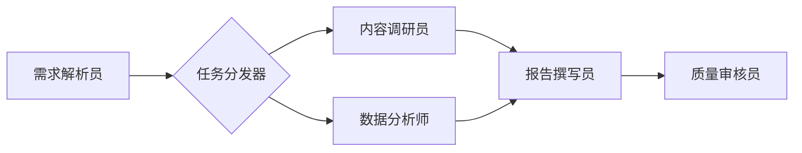

# 一人成军实战：用息壤拉起 AI 员工矩阵

## 引言：从“单兵作战”到“AI 军团”的范式转移

在 AI 应用落地的深水区，个体开发者与中小团队正面临新的生产力瓶颈：单个 AI Agent 能力有限，复杂业务难以闭环。行业趋势已从“打造超级个体”转向“构建 AI Agent 集群”。在这一背景下，“息壤”平台应运而生。它并非简单的对话机器人框架，而是定位为可自生长、可编排的 AI 员工基础设施。本文将通过实操演示，带你利用息壤平台的“成军台”模块，从零构建首个可交付业务的 AI 员工矩阵，真正实现“一人成军”。

## 第一章：筑基——在息壤中定义标准化 AI 员工

构建军团的第一步是招募合格的“士兵”。在息壤中，这意味将模糊的 Prompt 转化为结构化的岗位说明书。

### 1. 角色画像与能力边界
不要写“你是一个助手”，而要定义结构化配置。在息壤控制台中，创建一个名为 `content_researcher` 的员工：

```yaml
employee_id: content_researcher
role: 内容调研员
core_competencies:
  - web_search
  - document_summarization
boundaries:
  - no_creative_writing
  - max_tokens_per_task: 4000
system_prompt_template: |
  你是资深内容调研员。仅基于检索结果输出事实性摘要。
  禁止编造数据，引用必须标注来源链接。
```

### 2. 知识库与工具链挂载
为 AI 员工注入领域认知与执行手脚。在息壤中绑定向量知识库与外部 API：

```python
# 息壤 SDK 示例：挂载工具与知识
agent = XirangAgent("content_researcher")
agent.bind_knowledge_base("industry_reports_2024")
agent.register_tool("tavily_search", api_key="tvly-xxx")
agent.register_tool("notion_writer", auth_token="ntn-xxx")
```

### 3. 单兵验收测试
每个 AI 员工必须具备独立闭环的最小可用能力。使用息壤内置的 Eval 模块进行自动化测试，确保其在无协作环境下能准确完成单一任务，通过率需达 95% 以上方可进入编队环节。

## 第二章：布阵——通过成军台编排多智能体协作流

单兵合格不代表军团高效。息壤“成军台”提供了可视化编排能力，将离散的员工组装为有机整体。

### 1. 可视化编排实操
在成军台画布中，拖拽节点构建业务 SOP。以“竞品分析报告生成”为例，建立如下消息路由：



### 2. 协作模式设计
根据业务特性选择协作模式。上述流程采用“并行处理+串行汇总”混合模式。对于需要人工确认的环节（如选题审批），插入人机协同节点：

```json
{
  "node_type": "human_in_the_loop",
  "assignee": "product_manager@company.com",
  "timeout": "2h",
  "fallback_action": "escalate_to_team_lead"
}
```

### 3. 共享记忆与状态管理
多 Agent 协作最怕上下文割裂。息壤提供全局 Memory Store，所有员工可通过统一接口读写中间态数据，避免重复传递冗长上下文，显著降低 Token 消耗与信息失真。

## 第三章：练兵——AI 员工矩阵的压测与持续迭代

军团上线前必须经历严酷训练。息壤支持全链路仿真与自动进化。

### 1. 仿真环境对抗测试
导入历史真实案例作为测试集，在沙箱环境中运行完整矩阵。重点观察任务完成率、平均响应时长及错误传播路径。例如，模拟“搜索API限流”场景，验证矩阵的容错能力。

### 2. 异常熔断与兜底机制
为防止单点故障导致军团瘫痪，需在关键节点配置熔断策略：

```yaml
circuit_breaker:
  error_threshold: 3
  time_window: 60s
  fallback_employee: senior_researcher_backup
  alert_channel: slack_ops
```

当某员工连续失败时，自动切换至备用员工或降级处理，同时触发告警。

### 3. 基于反馈的自动进化
息壤的“自生长”特性体现在：系统会自动收集人工修正记录与用户反馈，生成优化建议。经管理员确认后，可一键更新员工的 System Prompt 或工具参数，实现技能的持续迭代。

## 第四章：出征——实战场景落地与效能度量

### 1. 典型业务场景接入
以内容生产为例，端到端跑通后，矩阵可每日自动生成 10 篇深度行业分析初稿，人类编辑仅需终审润色。客服场景中，一线 AI 解决率达 85%，复杂问题无缝转接二线专家 Agent。

### 2. 人机协作新范式
人类不再是执行者，而是“指挥官”。在息壤仪表盘上，实时监控各员工负载、任务队列与异常事件。仅在审核节点、策略调整与异常干预时介入，最大化释放人力。

### 3. ROI 量化评估体系
建立多维评估指标：

-   **任务完成率**：矩阵自主完成任务占比 > 90%
-   **响应时效**：端到端平均耗时 < 5 分钟
-   **人力替代比**：1 个 AI 矩阵 ≈ 3.5 名全职初级员工
-   **质量达标率**：人工审核通过率 > 92%

## 总结：驾驭 AI 军团的核心心法与未来展望

成功拉起 AI 员工矩阵的三个决定性因素：**标准化的岗位定义、鲁棒的编排架构、持续的反馈进化**。当前阶段需警惕过度追求全自动，应保留必要的人工监督节点；同时避免让 AI 承担超出其推理能力的决策任务。

展望未来，息壤正从预设编排向自主协商演进。下一代 AI 军团将具备自组织能力：员工可根据任务动态组队、协商分工、自我修复。届时，“一人成军”将不再依赖精密编排，而源于对 AI 生态的信任与治理。掌握这套心法，你便站在了智能时代生产力革命的最前沿。